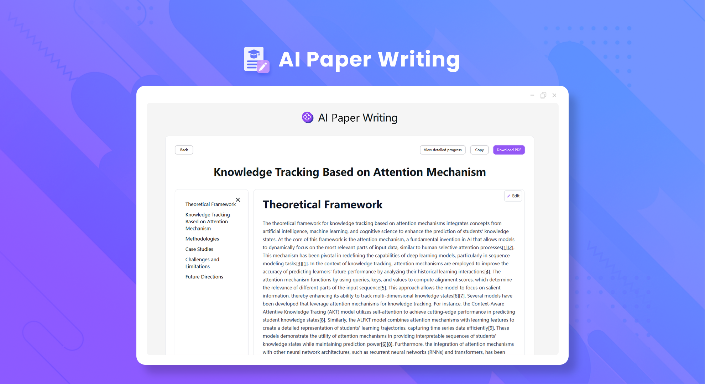
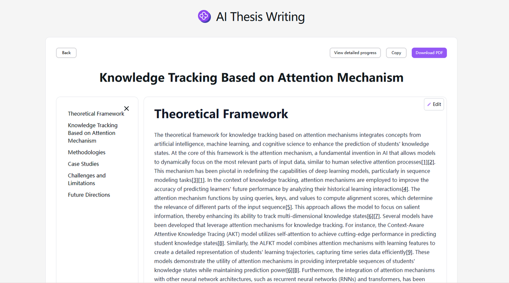

# 
✍️ AI Paper Writing 🚀✨

AI Paper Writing: According to the topic specified by the user, search for a large amount of relevant information through network search, integrate them, and generate a high-quality paper that can be downloaded as a clearly typeset PDF file.

<a href="README_zh.md">中文</a> | <a href="README.md">English</a> | <a href="README_ja.md">日本語</a>

Open-source version of the [AI Paper Writing](https://302.ai/en/tools/paper/) from [302.AI](https://302.ai).
You can directly log in to 302.AI for a zero-code, zero-configuration online experience.
Alternatively, customize this project to suit your needs, integrate 302.AI's API KEY, and deploy it yourself.

## Interface Preview
According to the topic input by the user, search for a large amount of relevant information through network search and integrate them to generate a high-quality paper.

## Project Features
### 🤖 Multi-perspective Analysis
It provides argument analysis from multiple perspectives to help you generate papers with rich content and profound insights.
### 🌐 Multi-language Support
You can easily write papers in Chinese, English, Japanese, German, French and Korean.
### ✏️ Flexible Editing
Modify the generated content as you like.
### 📄 Easy Export
Copy with one click and easily export it as a PDF format.
### 📜 History Record
It saves your creation history so that nothing is forgotten, and you can look up the previously created papers at any time.
### 🌍 Multi-interface Switching
- Chinese
- English
- Japanese
- German
- French
- Korean

With AI Paper Writing, anyone can become a paper creator! 🎉💻 Let's explore the new world of AI-driven papers together! 🌟🚀

## 🚩 Future Update Plans
- [ ] Enhance originality. Further optimize the algorithm to improve AI's understanding and integration ability of knowledge, enabling it to generate more innovative and unique viewpoints, arguments and discourses, and avoid directly copying or over-referencing existing literature
- [ ] AI provides professional review suggestions
- [ ] Meet specific format requirements

## Technology Stack
- Next.js 14
- Tailwind CSS
- NextUI
- Vercel AI SDK

## Development & Deployment
1. Clone the project `git clone https://github.com/302ai/302_paper_writing`
2. Install dependencies `pnpm install`
3. Configure the 302 API KEY based on .env.example
4. Run the project `pnpm dev`
5. Build and deploy `docker build -t paper-writing . && docker run -p 3000:3000 paper-writing`

## ✨ About 302.AI ✨
[302.AI](https://302.ai) is an enterprise-oriented AI application platform that offers pay-as-you-go services, ready-to-use solutions, and an open-source ecosystem.✨
1. 🧠 Comprehensive AI capabilities: Incorporates the latest in language, image, audio, and video models from leading AI brands.
2. 🚀 Advanced application development: We build genuine AI products, not just simple chatbots.
3. 💰 No monthly fees: All features are pay-per-use, fully accessible, ensuring low entry barriers with high potential.
4. 🛠 Powerful admin dashboard: Designed for teams and SMEs - managed by one, used by many.
5. 🔗 API access for all AI features: All tools are open-source and customizable (in progress).
6. 💡 Powerful development team: Launching 2-3 new applications weekly with daily product updates. Interested developers are welcome to contact us.
