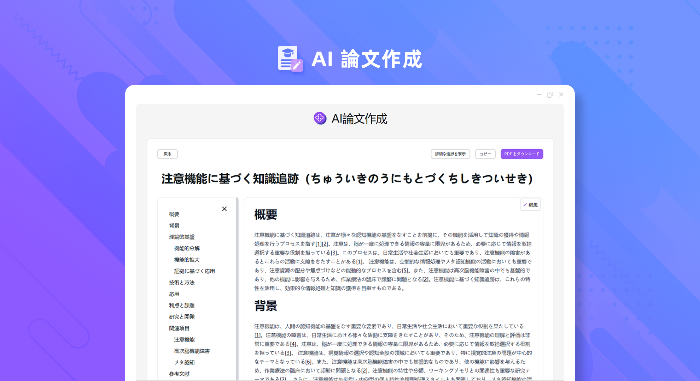
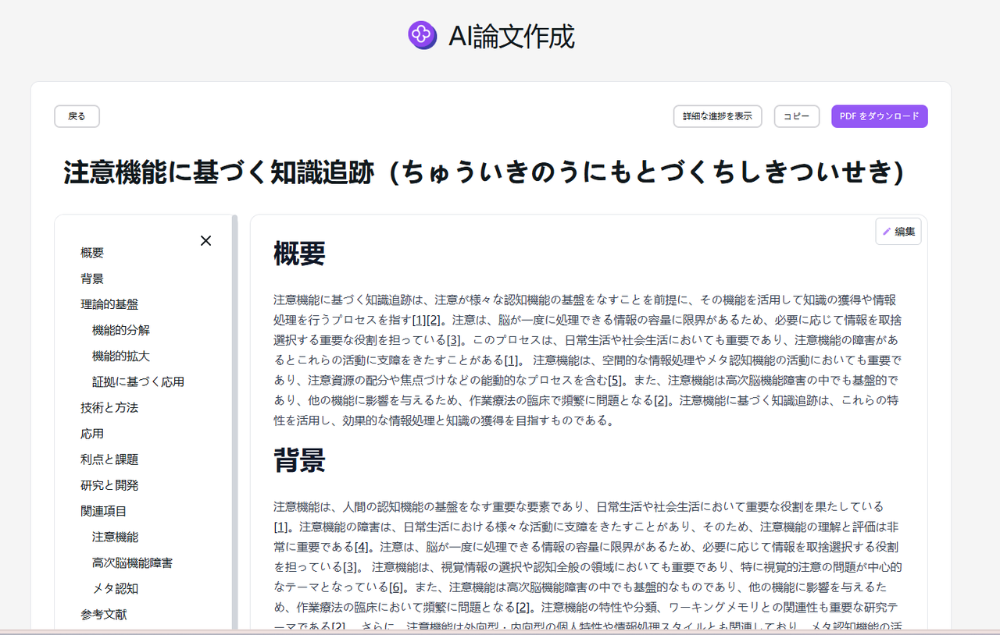

# 
✍️ AI論文作成 🚀✨

AI 論文執筆：ユーザーが指定した課題に基づき、ネット検索を通じて大量の関連情報を検索し、それらを統合して高品質の論文を生成し、体裁の良い PDF ファイルとしてダウンロードできる。

<a href="README_zh.md">中文</a> | <a href="README.md">English</a> | <a href="README_ja.md">日本語</a>

[302.AI](https://302.ai)の[AI論文作成](https://302.ai/tools/paper/)のオープンソース版です。
302.AIに直接ログインすることで、コード不要、設定不要のオンライン体験が可能です。
あるいは、このプロジェクトをニーズに合わせてカスタマイズし、302.AIのAPI KEYを統合して、自身でデプロイすることもできます。

## インターフェースプレビュー
ユーザーが入力したテーマに基づき、ネット検索を通じて大量の関連情報を検索し、それらを統合して高品質の論文を生成する。

## プロジェクトの特性
### 🤖 多角的な分析
多角的な論点分析を提供し、内容が豊富で深い洞察を持つ論文を生成するのを助けます。
### 🌐 多言語サポート
中国語、英語、日本語、ドイツ語、フランス語、韓国語で簡単に論文を書くことができます。
### ✏️ 柔軟な編集
生成された内容を好きなように修正できます。
### 📄 簡単なエクスポート
1 つのボタンをクリックしてコピーし、簡単に PDF 形式でエクスポートできます。
### 📜 履歴記録
あなたの創作履歴を保存し、記憶が失われることがなく、以前に作成した論文をいつでも検索できます。
### 🌍 多インターフェース切り替え
- 中国語
- 英語
- 日本語
- ドイツ語
- フランス語
- 韓国語

AI論文作成を通じて、誰でも論文クリエイターになれます! 🎉💻 AI駆動の新しい論文世界を一緒に探求しましょう! 🌟🚀

## 🚩 将来のアップデート計画
- [ ] 独創性を強化する。アルゴリズムをさらに最適化し、AI の知識理解と融合能力を向上させ、より革新的で独特な見解、論拠及び議論を生成できるようにし、既存の文献を直接コピーしたり、過度に参照したりすることを避ける
- [ ] AI は専門的な審査アドバイスを提供する
- [ ] 特定のフォーマット要件を満たす

## 技術スタック
- Next.js 14
- Tailwind CSS
- NextUI
- Vercel AI SDK

## 開発とデプロイ
1. プロジェクトをクローン `git clone https://github.com/302ai/302_paper_writing`
2. 依存関係をインストール `pnpm install`
3. .env.exampleを参照して302のAPIキーを設定
4. プロジェクトを実行 `pnpm dev`
5. ビルドとデプロイ `docker build -t paper-writing . && docker run -p 3000:3000 paper-writing`

## ✨ 302.AIについて ✨
[302.AI](https://302.ai)は、AIの能力と実用的な実装の間のギャップを埋める、従量制のAIアプリケーションプラットフォームです。
1. 🧠 包括的なAI機能：主要AIブランドの最新の言語、画像、音声、ビデオモデルを統合。
2. 🚀 高度なアプリケーション開発：単なるシンプルなチャットボットではなく、本格的なAI製品を構築。
3. 💰 月額料金なし：すべての機能が従量制で、完全にアクセス可能。低い参入障壁と高い可能性を確保。
4. 🛠 強力な管理ダッシュボード：チームやSME向けに設計 - 一人で管理し、多くの人が使用可能。
5. 🔗 すべてのAI機能へのAPIアクセス：すべてのツールはオープンソースでカスタマイズ可能（進行中）。
6. 💪 強力な開発チーム：大規模で高度なスキルを持つ開発者集団。毎週2-3の新しいアプリケーションをリリースし、毎日製品更新を行っています。才能ある開発者の参加を歓迎します。
