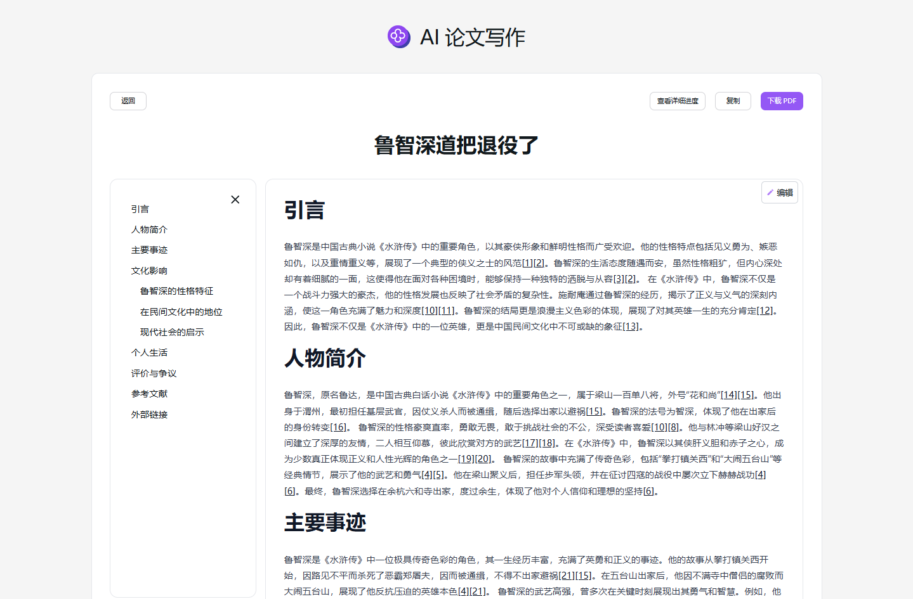

# ✍️🤖 302.AIのAI論文作成へようこそ! 🚀✨

[中文](README_zh.md) | [English](README.md) | [日本語](README_ja.md)

[302.AI](https://302.ai)の[AI論文作成](https://302.ai/tools/paper/)のオープンソース版です。
302.AIに直接ログインすることで、コード不要、設定不要のオンライン体験が可能です。
あるいは、このプロジェクトをニーズに合わせてカスタマイズし、302.AIのAPI KEYを統合して、自身でデプロイすることもできます。

## ✨ 302.AIについて ✨
[302.AI](https://302.ai)は、AIの能力と実用的な実装の間のギャップを埋める、従量制のAIアプリケーションプラットフォームです。
1. 🧠 包括的なAI機能：主要AIブランドの最新の言語、画像、音声、ビデオモデルを統合。
2. 🚀 高度なアプリケーション開発：単なるシンプルなチャットボットではなく、本格的なAI製品を構築。
3. 💰 月額料金なし：すべての機能が従量制で、完全にアクセス可能。低い参入障壁と高い可能性を確保。
4. 🛠 強力な管理ダッシュボード：チームやSME向けに設計 - 一人で管理し、多くの人が使用可能。
5. 🔗 すべてのAI機能へのAPIアクセス：すべてのツールはオープンソースでカスタマイズ可能（進行中）。
6. 💪 強力な開発チーム：大規模で高度なスキルを持つ開発者集団。毎週2-3の新しいアプリケーションをリリースし、毎日製品更新を行っています。才能ある開発者の参加を歓迎します。

## プロジェクトの特性
1. 🤖 多視点の論点分析を提供し、内容豊かで洞察力に富んだ論文作成をサポートします。
2. 🌐 多言語サポート：日本語、英語、中国語、ドイツ語、フランス語、韓国語で簡単に作成できます。
3. ✏️ 柔軟な編集：生成された内容を自由に編集可能。
4. 📄 ワンクリック複製、PDF形式で簡単にエクスポート。
5. 📜 完全な履歴記録：以前に作成した論文をいつでも検索可能。
6. 🔄 多言語インターフェースのシームレスな切り替え：日本語、英語、中国語、ドイツ語、フランス語、韓国語などをサポート。

AI論文作成を通じて、誰でも論文クリエイターになれます! 🎉💻 AI駆動の新しい論文世界を一緒に探求しましょう! 🌟🚀

## 技術スタック
- Next.js 14
- Tailwind CSS
- NextUI
- Vercel AI SDK

## 開発とデプロイ
1. プロジェクトをクローン `git clone https://github.com/302ai/302_paper_writing`
2. 依存関係をインストール `pnpm install`
3. .env.exampleを参照して302のAPIキーを設定
4. プロジェクトを実行 `pnpm dev`
5. ビルドとデプロイ `docker build -t paper-writing . && docker run -p 3000:3000 paper-writing`

## インターフェースプレビュー

