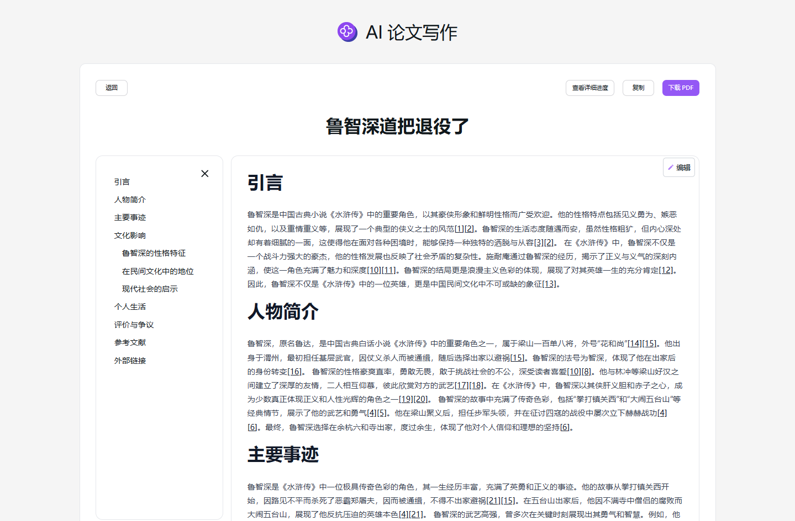

# 
✍️ AI 论文写作 🚀✨

AI论文写作根据用户指定的课题，通过联网搜索搜寻大量相关信息加以整合生成一份高质量的论文，可下载为排版清晰的PDF文件。

<a href="README zh.md">中文</a> | <a href="README.md">English</a> | <a href="README_ja.md">日本語</a>

来自[302.AI](https://302.ai)的[AI论文写作](https://302.ai/tools/paper/)的开源版本。
你可以直接登录302.AI，零代码零配置使用在线版本。
或者对本项目根据自己的需求进行修改，传入302.AI的API KEY，自行部署。

## 界面预览

## 项目特性
### 🤖 多视角分析
  提供多视角的论点分析，助你生成内容丰富、见解深刻的论文。
### 🌐 多语言支持
  可用中文、英文、日文、德语、法语、韩语轻松写作。
### ✏️ 灵活编辑
  对生成内容随心修改。
### 📄 轻松导出
  一键复制，轻松导出为PDF格式。
### 📜 历史记录
  保存您的创作历史,记忆不丢失，随时查找之前创建的论文。
### 🌍 多界面切换
- 中文
- English
- 日本語
- 德语
- 法语
- 韩语

通过AI论文写作,任何人都可以成为论文创作者! 🎉💻 让我们一起探索AI驱动的论文新世界吧! 🌟🚀

## 🚩 未来更新计划
- 增强原创性，进一步优化算法，提高 AI 对知识的理解和融合能力，使其能够生成更具创新性和独特性的观点、论据及论述，避免直接复制或过度借鉴已有文献
- AI提供专业审核建议
- 满足特定格式要求
  
## 技术栈
- Next.js 14
- Tailwind CSS
- NextUI
- Vecel AI SDK

## 开发&部署
1. 克隆项目 `git clone https://github.com/302ai/302_paper_writing`
2. 安装依赖 `pnpm install`
3. 配置302的API KEY 参考.env.example
4. 运行项目 `pnpm dev`
5. 打包部署 `docker build -t paper-writing . && docker run -p 3000:3000 paper-writing`

## ✨ 302.AI介绍 ✨
[302.AI](https://302.ai)是一个按需付费的AI应用平台，为用户解决AI用于实践的最后一公里问题。
1. 🧠 集合了最新最全的AI能力和品牌，包括但不限于语言模型、图像模型、声音模型、视频模型。
2. 🚀 在基础模型上进行深度应用开发，我们开发真正的AI产品，而不是简单的对话机器人
3. 💰 零月费，所有功能按需付费，全面开放，做到真正的门槛低，上限高。
4. 🛠 功能强大的管理后台，面向团队和中小企业，一人管理，多人使用。
5. 🔗 所有AI能力均提供API接入，所有工具开源可自行定制（进行中）。
6. 💡 强大的开发团队，每周推出2-3个新应用，产品每日更新。有兴趣加入的开发者也欢迎联系我们
